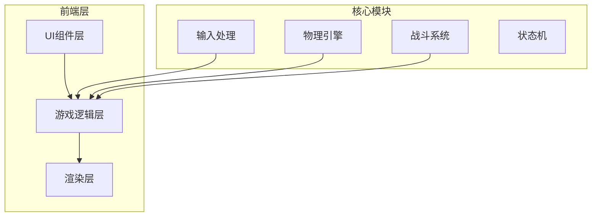

# 像素风机甲对战游戏 - 技术架构文档

## 1. 架构设计



## 2. 技术选型

- **框架**: React 18 + TypeScript
- **构建工具**: Vite
- **样式**: Tailwind CSS
- **状态管理**: Zustand
- **游戏渲染**: Canvas 2D API
- **动画**: requestAnimationFrame

## 3. 项目结构

```
src/
├── components/          # React组件
│   ├── Game.tsx        # 游戏主容器
│   ├── GameCanvas.tsx  # Canvas渲染组件
│   └── UI/             # UI组件
│       ├── StartScreen.tsx
│       ├── HUD.tsx
│       └── GameOver.tsx
├── game/               # 游戏核心逻辑
│   ├── engine/         # 游戏引擎
│   │   ├── GameEngine.ts
│   │   ├── InputManager.ts
│   │   └── CollisionSystem.ts
│   ├── entities/      # 实体
│   │   ├── Mecha.ts
│   │   └── Projectile.ts
│   ├── systems/       # 游戏系统
│   │   ├── CombatSystem.ts
│   │   └── PhysicsSystem.ts
│   └── utils/        # 工具函数
│       ├── SpriteRenderer.ts
│       └── constants.ts
├── store/             # Zustand状态
│   └── gameStore.ts
├── App.tsx
└── main.tsx
```

## 4. 核心类设计

### 4.1 GameEngine (游戏引擎)

```typescript
class GameEngine {
    canvas: HTMLCanvasElement;
    ctx: CanvasRenderingContext2D;
    players: Mecha[];
    state: GameState;
    lastTime: number;
    
    start(): void;
    update(deltaTime: number): void;
    render(): void;
    gameLoop(): void;
}
```

### 4.2 Mecha (机甲实体)

```typescript
interface MechaState {
    x: number;
    y: number;
    hp: number;
    maxHp: number;
    facing: 'left' | 'right';
    state: 'idle' | 'walk' | 'attack' | 'defend' | 'hit';
    isDefending: boolean;
    attackCooldown: number;
    velocityX: number;
    velocityY: number;
}

class Mecha {
    state: MechaState;
    animations: AnimationFrames;
    
    move(direction: number): void;
    jump(): void;
    attack(): void;
    defend(): void;
    takeDamage(amount: number): void;
    update(deltaTime: number): void;
    render(ctx: CanvasRenderingContext2D): void;
}
```

### 4.3 CombatSystem (战斗系统)

```typescript
class CombatSystem {
    checkAttackCollision(attacker: Mecha, defender: Mecha): boolean;
    calculateDamage(attackPower: number, isDefending: boolean): number;
    applyDamage(target: Mecha, damage: number): void;
}
```

## 5. 渲染系统

### 5.1 像素角色绘制

使用Canvas 2D API绘制像素角色：
- 基础几何形状组合（矩形、圆形）
- 颜色填充模拟像素点
- 动画帧切换实现动作

### 5.2 特效系统

- 攻击火花: 粒子效果
- 防御护盾: 半透明圆形
- 受击闪烁: alpha值变化
- 背景星空: 随机粒子生成

## 6. 状态管理

使用Zustand管理游戏状态：

```typescript
interface GameStore {
    gameState: 'menu' | 'countdown' | 'playing' | 'gameover';
    winner: number | null;
    scores: [number, number];
    
    startGame: () => void;
    endGame: (winner: number) => void;
    resetGame: () => void;
    updateScores: () => void;
}
```

## 7. 输入处理

键盘映射表：

| 功能 | 玩家1 | 玩家2 |
|------|-------|-------|
| 左移 | A | ← |
| 右移 | D | → |
| 跳跃 | W | ↑ |
| 防御 | K | M |
| 攻击 | J | N |
| 开始/重开 | 空格 | 空格 |

## 8. 物理系统

- 重力加速度: 0.5
- 移动速度: 5
- 跳跃力度: -12
- 地面碰撞: y >= 400
- 角色碰撞: 距离 < 80

## 9. 性能优化

- 使用requestAnimationFrame确保60FPS
- 对象池复用粒子效果
- 最小化Canvas状态切换
- 避免在渲染循环中创建对象
