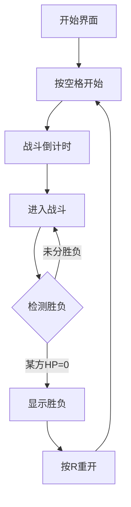

# 像素风机甲对战游戏 - 产品需求文档

## 1. 产品概述

一款双人对战类像素风机甲格斗游戏，两名玩家操控各自的机甲进行战斗。游戏采用复古像素风格，通过键盘控制实现移动、攻击、防御等操作，具有简单的血量系统和胜负判定机制。

## 2. 核心功能

### 2.1 玩家角色

| 角色 | 操控 | 特色 |
|------|------|------|
| 红色机甲「烈焰」 | 玩家1: WASD移动 + J攻击 + K防御 | 高攻击输出 |
| 蓝色机甲「寒霜」 | 玩家2: 方向键移动 + N攻击 + M防御 | 高防御能力 |

### 2.2 战斗系统

- **移动**: 左右移动、跳跃
- **攻击**: 近距离拳击，命中造成10点伤害
- **防御**: 减少50%受到伤害
- **血量**: 每个机甲100点HP
- **冷却**: 攻击间隔1秒，防御持续0.5秒

### 2.3 游戏流程

1. 开始界面 → 按空格开始
2. 战斗倒计时3-2-1
3. 双方对战
4. 任意一方HP归零 → 显示胜负
5. 按R键重新开始

### 2.4 胜负机制

- 当一方血量降至0时，另一方获胜
- 屏幕中央显示胜负结果
- 记录并显示双方累计胜利次数

## 3. 核心流程

## 4. 视觉设计

### 4.1 美术风格

- **整体风格**: 16位复古像素风格
- **分辨率**: 800x600 Canvas
- **像素密度**: 角色高度约64像素
- **配色方案**:
  - 背景: 深空灰色 #1a1a2e
  - 地面: 金属灰色 #4a4a6a
  - 红色机甲: #e63946, #ff6b6b
  - 蓝色机甲: #4361ee, #4cc9f0
  - UI文字: #f1faee, #ffd700

### 4.2 角色动画

- **待机**: 轻微上下浮动
- **移动**: 左右行走帧
- **攻击**: 出拳动画
- **防御**: 护盾特效
- **受击**: 闪烁效果

### 4.3 场景元素

- 金属质感地面平台
- 背景星空粒子效果
- 战斗特效（攻击火花、防御光盾）
- 血条UI（带像素边框）

## 5. 响应式设计

- 固定Canvas尺寸800x600，居中显示
- 键盘事件全局监听
- 支持主流浏览器（Chrome、Firefox、Edge）

## 6. 技术约束

- 纯前端实现，无需后端
- 使用Canvas 2D渲染
- 帧率目标: 60FPS
- 无需外部图片资源，角色纯代码绘制
